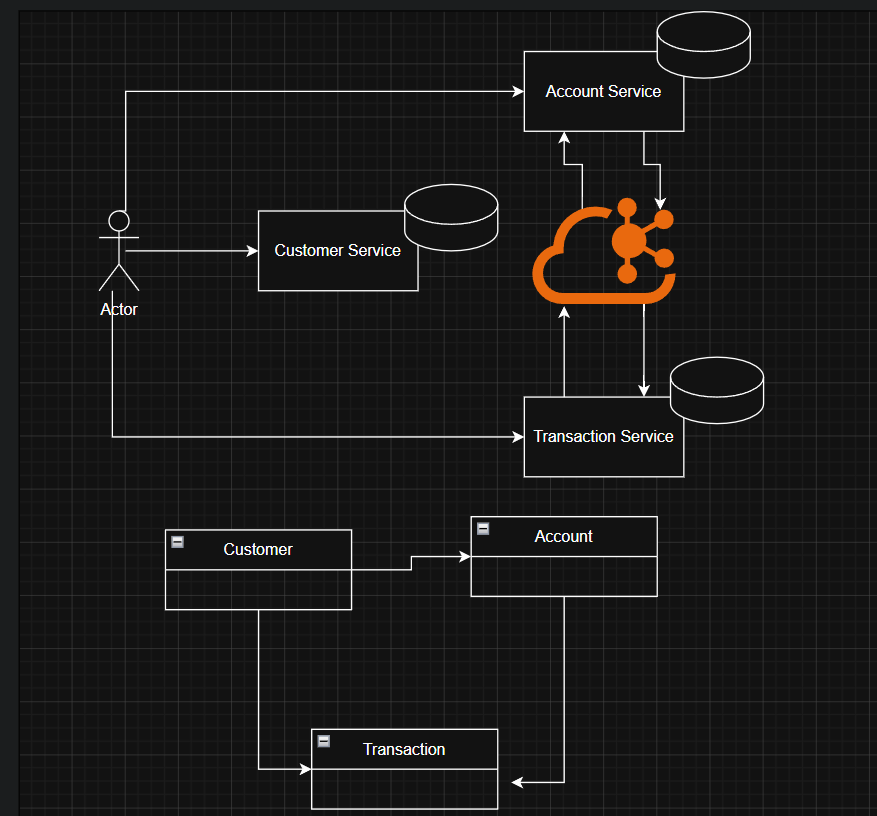
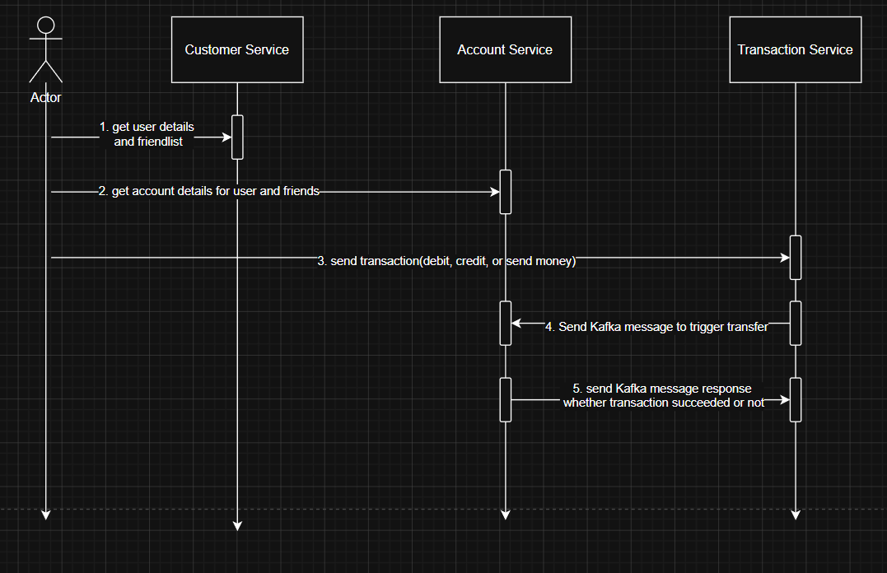

Here is a professional, production-ready README.md tailored for your digital wallet backend architecture.
## Digital Wallet Backend Services
This repository contains the distributed backend architecture for a highly scalable, event-driven Digital Wallet platform. The system is split into three decoupled microservices interacting through synchronous REST APIs and asynchronous event streaming via Apache Kafka.
------------------------------
## 🏗️ Architecture Overview

                      +-------------------+

                      |   API Gateway /   |
                      |   Client Apps     |
                      +---------+---------+
                                |
        +-----------------------+-----------------------+

        | (REST)                | (REST)                | (REST)
        v                       v                       v
+-------+----------+    +-------+----------+    +-------+----------+

| customer-service |    |  account-service |    |transaction-servic|
+------------------+    +------------------+    +------------------+

| Customer Profile |    | Wallet Balances  |    | General Ledger   |
+------------------+    +---------+--------+    +---------+--------+
^                       |

                                  |      Kafka Broker     |
                                  +--- [Account Events] --+

## 1. customer-service

* Purpose: Manages user identity, onboarding, and profile details.
* Core Capabilities: KYC verification, profile updates, account state locking.

## 2. account-service

* Purpose: Manages core wallet asset parameters, account limits, and real-time balances.
* Core Capabilities: Holds current ledger balance, applies credit/debit adjustments, and listens to event-driven updates.

## 3. transaction-service

* Purpose: Functions as the absolute, append-only immutable general ledger.
* Core Capabilities: Orchestrates fund transfers, records historical entries, and broadcasts immutable state updates.

------------------------------
## ⚡ Event-Driven Ecosystem (Kafka)
The system relies on asynchronous events to guarantee eventual consistency across balances and ledgers:

1. Transaction Initiated: transaction-service registers a pending movement.
2. Event Broadcast: A TransactionCreatedEvent drops onto the Kafka topic wallet-transactions.
3. Balance Update: account-service consumes the message, recalculates the specific user balance, and commits changes locally.

------------------------------
## 🧭 API Documentation & Interactive Exploration
Each microservice exposes an individual Open-API/Swagger documentation playground. Ensure the targeted service is running locally before executing the links below.

| Service | Local Base URL        | Swagger Endpoint                      |
|---|-----------------------|---------------------------------------|
| customer-service | http://localhost:8080 | http://localhost:8080/swagger-ui.html |
| account-service | http://localhost:8082 | http://localhost:8082/swagger-ui.html |
| transaction-service | http://localhost:8081 | http://localhost:8081/swagger-ui.html |

------------------------------
## 🚀 Local Initialization & Quickstart## Prerequisites

* Docker & Docker Compose
* Java 17+ or Node.js v18+ (depending on runtime implementation)

## Step 1: Fire Up Infrastructure (Kafka & Databases)

docker-compose up -d 

## Step 2: Run the Microservices
Execute the setup instructions sequentially within individual terminal instances or run them concurrently using your chosen service orchestrator.

# Start Customer Service
cd customer-service && ./gradlew bootRun
# Start Account Service
cd ../account-service && ./gradlew bootRun
# Start Transaction Service
cd ../transaction-service && ./gradlew bootRun

# Architecture

# Design Flow
